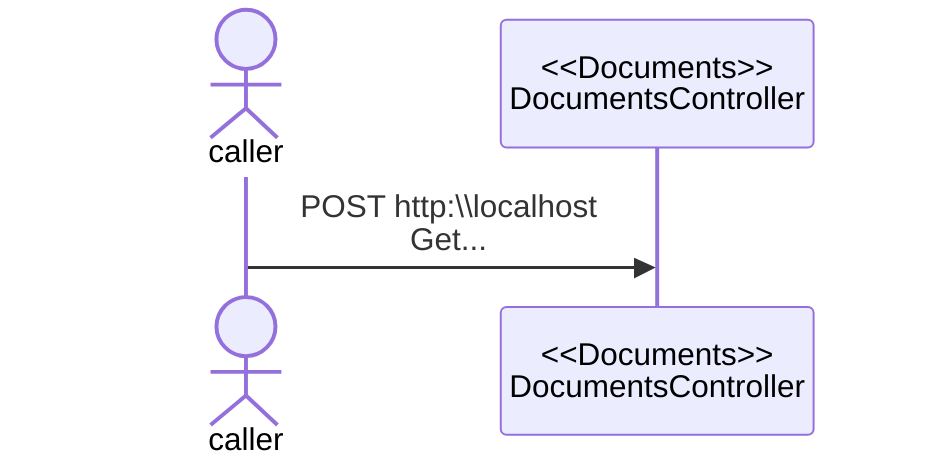

# Throw-away hints and reminders
Throw this away when you're done with it.

- Change history is best left to the issue on DevOps. Always record discussions and changes there.
- Always remember to do your branch maintenance. You'll see some of that maintenance tasks provided here after your references section.

# @{DocumentTitle}

@{PlatformWebBranchUrlText}
@{PlatformApiBranchUrlText}
@{PlatformDatabaseBranchUrlText}

```bash
@{Branch}
```
- [Pull Request Reference]

## GCNs

| Usage | GCN | Entity No | 
| --- | --- | --- | 
| Used to get to the AB stuck thingy screen | 0000000000 | 000000 | 
| Used to get to the AB stuck thingy screen | 0000000000 | 000000 | 

## Affected Use Cases

### Use Case 1
Lorem ipsum dolor sit amet, consectetur adipiscing elit, sed do eiusmod tempor incididunt ut labore et dolore magna aliqua. Feugiat nibh sed pulvinar proin gravida. Quam pellentesque nec nam aliquam sem et tortor consequat. Vitae aliquet nec ullamcorper sit amet risus. Malesuada pellentesque elit eget gravida.



### Use Case 1
Lorem ipsum dolor sit amet, consectetur adipiscing elit, sed do eiusmod tempor incididunt ut labore et dolore magna aliqua. Feugiat nibh sed pulvinar proin gravida. Quam pellentesque nec nam aliquam sem et tortor consequat. Vitae aliquet nec ullamcorper sit amet risus. Malesuada pellentesque elit eget gravida. Et netus et malesuada fames ac turpis egestas integer eget.

Non sodales neque sodales ut etiam sit. Eu scelerisque felis imperdiet proin fermentum. Dignissim suspendisse in est ante.

Arcu cursus euismod quis viverra nibh cras pulvinar mattis. Ipsum dolor sit amet consectetur adipiscing. Eu nisl nunc mi ipsum faucibus vitae. Nam libero justo laoreet sit amet cursus sit amet dictum. Ut tellus elementum sagittis vitae et leo duis. In est ante in nibh mauris. Arcu odio ut sem nulla pharetra diam sit amet nisl.


## Testing Scenarios
- How will we test this stuff.
- What tests are required?

## References

### Concept References
- [Reference](https://www.msn.com)
- [Reference](https://www.msn.com)
- [Reference](https://www.msn.com)

### Teams Discussions
- [Reference](https://www.msn.com)
- [Reference](https://www.msn.com)
- [Reference](https://www.msn.com)

### Meeting Video Streams
- [Reference](https://www.msn.com)
- [Reference](https://www.msn.com)
- [Reference](https://www.msn.com)

# Branch Maintenance

#### Merge latest prod into your branch (after a PS or feature release)

```bash
git checkout main
git pull
git switch @{Branch}
git merge main
```
Once done, you might need to merge this branch into any satellite branches you have above this one.
